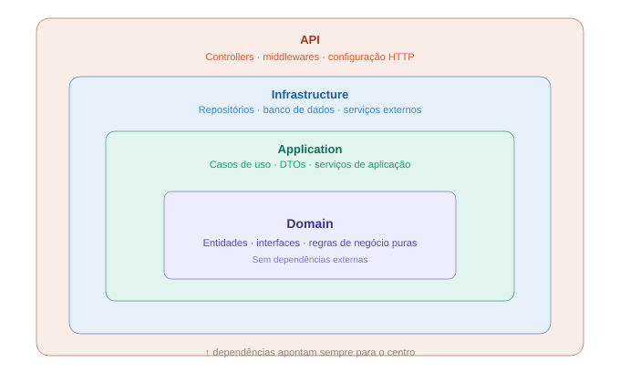

# Tech Challenge — FIAP

> Sistema Integrado de Atendimento e Execução de Serviços para uma oficina mecânica. Permite o gerenciamento de clientes, veículos, produtos, serviços e ordens de serviço — com infraestrutura escalável, orquestração em Kubernetes e pipeline de CI/CD automatizado.

---

## Fase 1 — MVP do Sistema da Oficina

Nesta primeira etapa foi desenvolvido o MVP do sistema de gerenciamento da oficina mecânica, com foco em organização operacional, rastreabilidade dos serviços e centralização das informações.

Objetivos da fase:

- Gerenciar clientes e veículos
- Controlar produtos e peças utilizadas nos serviços
- Registrar ordens de serviço
- Acompanhar o status dos atendimentos
- Garantir persistência e integridade dos dados
- Aplicar boas práticas de arquitetura e qualidade de software

---

## Fase 2 — Infraestrutura, Escalabilidade e CI/CD

Após a implantação do sistema inicial, com o aumento da demanda e a expansão para novas unidades, surgiu a necessidade de evoluir a aplicação. Os objetivos desta fase são:

- Reduzir riscos operacionais por meio de infraestrutura escalável
- Automatizar o provisionamento e o deploy do ambiente
- Melhorar a qualidade e organização do código com **Clean Architecture**
- Preparar a aplicação para suportar grandes volumes de ordens de serviço em horários de pico com escalabilidade dinâmica

### O que foi adicionado nesta fase

| O que | Descrição |
|---|---|
| **Clean Architecture** | Reorganização do código em camadas Domain, Application, Infrastructure e API |
| **Kubernetes** | Orquestração com Deployments, Services, ConfigMaps, Secrets e HPA |
| **Terraform** | Provisionamento da infraestrutura como código |
| **CI/CD** | Pipeline automatizado com GitHub Actions e self-hosted runner |
| **PostgreSQL containerizado** | StatefulSet com persistência via PVC |

---

## Tech Stack

O projeto foi desenvolvido com **C# / .NET 9** e **PostgreSQL 16** como banco de dados principal.

| Componente | Tecnologia | Descrição |
|---|---|---|
| API | ASP.NET Core 9 | REST API principal da oficina |
| Banco de Dados | PostgreSQL 16 | Persistência dos dados |
| Orquestração | Kubernetes (Minikube) | Deploy e escalabilidade automática |
| IaC | Terraform | Provisionamento da infraestrutura como código |
| CI/CD | GitHub Actions | Automação de build, testes e deploy |

---

## Arquitetura

O projeto segue os princípios da **Clean Architecture**, organizado em camadas com dependências apontando sempre para o centro:

```
src/
├── Domain/              ← entidades, interfaces, regras de negócio puras
├── Application/         ← casos de uso, DTOs, serviços de aplicação
├── Infrastructure/      ← repositórios, banco de dados, serviços externos
├── API/                 ← controllers, middlewares, configuração HTTP
└── SharedKernel/        ← tipos comuns, extensões e utilitários compartilhados
```

- **Domain** não depende de nada — contém as entidades e contratos
- **Application** depende apenas do Domain
- **Infrastructure** implementa as interfaces do Domain
- **API** orquestra tudo e expõe os endpoints REST
- **SharedKernel** é referenciado por todas as camadas — contém tipos base, extensões e utilitários sem dependência de negócio



---

## Infraestrutura e CI/CD

A infraestrutura é orquestrada em Kubernetes (Minikube) e provisionada como código via Terraform. O deploy é totalmente automatizado via GitHub Actions com self-hosted runner: o pipeline garante que o Minikube está de pé e roda `terraform apply` a cada push em `main`, sem passos manuais.

Para o detalhamento completo — diagramas, recursos provisionados, fluxo de deploy e módulos Terraform — veja [docs/infra.md](./docs/infra.md).

---

## Como começar

```bash
git clone https://github.com/monnclaro/soat-tech-challenge
cd soat-tech-challenge
```

---

## Execução local

### Com Docker

Copie o arquivo de exemplo e preencha as variáveis:

```bash
cp .env.example .env
```

| Variável | Descrição |
|---|---|
| `POSTGRES_PASSWORD` | Senha do banco de dados PostgreSQL |
| `ConnectionStrings__Default` | String de conexão (ajuste a senha conforme definida acima) |
| `JwtSettings__Secret` | Chave JWT (mínimo 32 caracteres) |
| `Webhook__Secret` | Secret Webhook |

### Sem Docker

Ajuste o arquivo `appsettings.Development.json` na raiz do projeto:

```json
{
  "ConnectionStrings": {
    "Default": "Server=localhost;Database=soattechchallenge;User Id=postgres;Password=sua_senha_aqui;TrustServerCertificate=True"
  },
  "JwtSettings": {
    "Secret": "SuaChaveSuperSecretaComMinimo32Caracteres",
    "ExpirationHours": 2
  },
  "Webhook": {
    "Secret": "secret_webhook"
  }
}
```

---

## Deploy em Kubernetes

```powershell
# 1. Iniciar o cluster
minikube start
minikube addons enable metrics-server

# 2. Buildar e carregar a imagem
docker build -t soat-api:latest -f src/Api/Dockerfile .
minikube image load soat-api:latest

# 3. Aplicar os manifestos
kubectl apply -f k8s/postgres/
kubectl apply -f k8s/configmap.yaml
kubectl apply -f k8s/secret.yaml
kubectl apply -f k8s/deployment.yaml
kubectl apply -f k8s/service.yaml
kubectl apply -f k8s/hpa.yaml

# 4. Abrir no browser
minikube service soat-api-service -n soat
```

---

## Provisionamento com Terraform

```powershell
cd infra
terraform init
terraform apply
```

> No CI/CD esses mesmos comandos rodam automaticamente a cada push em `main`, com `terraform apply -var="restart_trigger=<run_id>"` para forçar o rollout da aplicação a cada deploy.

---

## API

A porta é exibida ao rodar `minikube service soat-api-service -n soat`.

📄 Collection: [collection.json](./collection.json)
