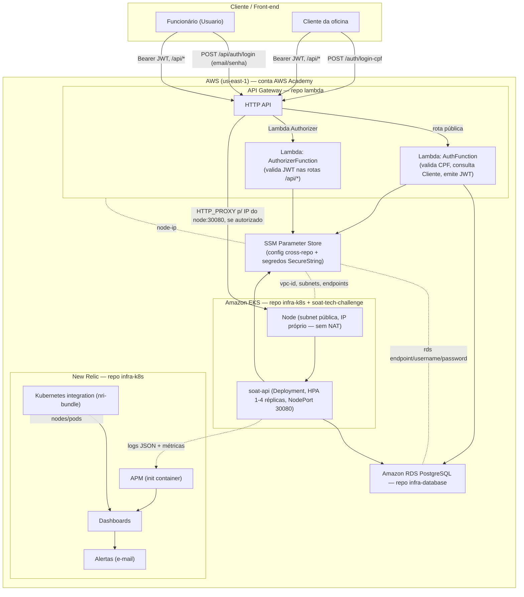

# Diagrama de Componentes (Visão de Nuvem)

Visão C4 (nível de container) da solução na Fase 3: API Gateway, autenticação serverless, cluster Kubernetes, banco gerenciado e observabilidade, através dos 4 repositórios. Infraestrutura ajustada para AWS Academy — sem ALB, sem NAT, sem Secrets Manager (ver [ADR 0008](./adr/0008-prioridade-de-custo-aws-academy.md)).

## Mapeamento repositório → componente

| Componente no diagrama | Repositório |
|---|---|
| API Gateway, AuthFunction, AuthorizerFunction | [soat-tech-challenge-lambda](https://github.com/monnclaro/soat-tech-challenge-lambda) |
| VPC, EKS, New Relic (integração + dashboards + alertas) | [soat-tech-challenge-infra-k8s](https://github.com/monnclaro/soat-tech-challenge-infra-k8s) |
| RDS, credenciais em SSM SecureString | [soat-tech-challenge-infra-database](https://github.com/monnclaro/soat-tech-challenge-infra-database) |
| Deployment/Service (NodePort)/HPA `soat-api`, código da API | [soat-tech-challenge](https://github.com/monnclaro/soat-tech-challenge) (este repositório) |

## Diagramas complementares

- Diagrama de sequência — autenticação por CPF: [sequence-auth-cpf.md](./sequence-auth-cpf.md)
- Diagrama de sequência — abertura de ordem de serviço: [sequence-abertura-os.md](./sequence-abertura-os.md)
- Diagrama entidade-relacionamento: [der.md](./der.md)
- RFCs: [rfcs/](./rfcs)
- ADRs: [adr/](./adr) — em especial [0008](./adr/0008-prioridade-de-custo-aws-academy.md) para as decisões de custo/AWS Academy
