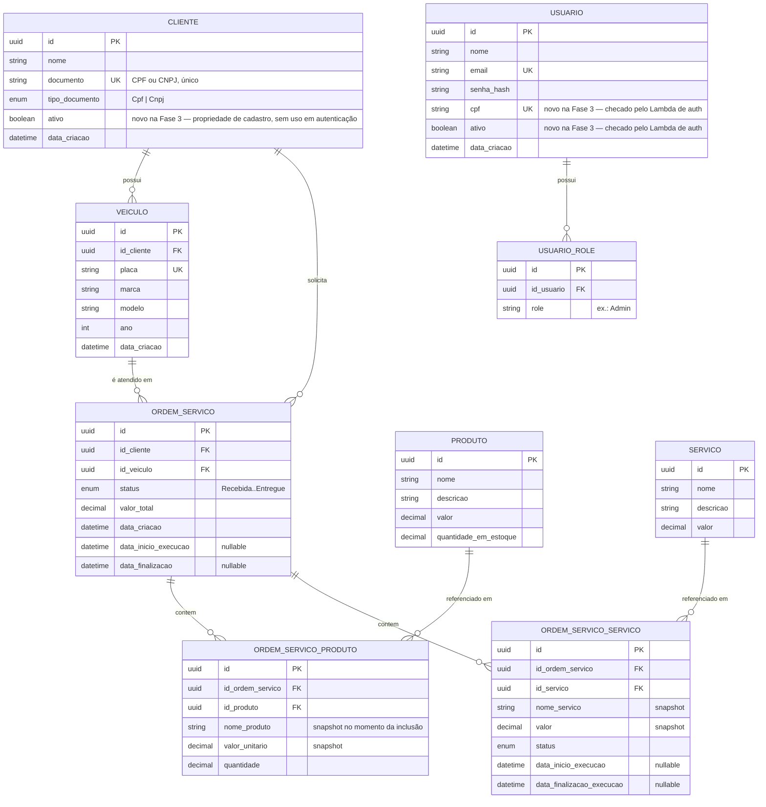

# Diagrama Entidade-Relacionamento

Justificativa da escolha do banco: [rfcs/0002-escolha-do-banco-de-dados.md](./rfcs/0002-escolha-do-banco-de-dados.md).

## Explicação dos relacionamentos

- **Cliente 1—N Veículo**: um cliente pode ter vários veículos cadastrados (`Veiculo.IdCliente`).
- **Cliente 1—N OrdemServico** e **Veiculo 1—N OrdemServico**: cada OS pertence a exatamente um cliente e um veículo — a FK dupla existe porque, embora o veículo já implique o cliente, a consulta por cliente (`BuscarPaginadoPorDocumento`) e por veículo são ambas caminhos de acesso frequentes o suficiente para justificar guardar as duas FKs em vez de fazer join através de `Veiculo` sempre.
- **OrdemServico 1—N OrdemServicoProduto/OrdemServicoServico**: tabelas de associação que também guardam um **snapshot** de nome e valor no momento da inclusão (`NomeProduto`, `ValorUnitario`, `NomeServico`, `Valor`) — decisão de modelagem anterior à Fase 3, mantida porque altera a rastreabilidade histórica: se o preço de um produto mudar depois, ordens de serviço antigas continuam refletindo o valor cobrado na época, não o valor atual do catálogo.
- **Produto/Servico 1—N (via tabelas de associação)**: o catálogo (`Produto`, `Servico`) é referenciado, mas nunca alterado, por uma OS já criada — mudanças em `Produto.Valor`/`Servico.Valor` não retroagem.
- **Usuario 1—N UsuarioRole**: um funcionário pode ter múltiplas roles (hoje, na prática, só `Admin` é usada nos controllers).
- **Usuario.Cpf / Usuario.Ativo** (Fase 3): não são relacionamentos, mas o principal ajuste desta fase no modelo — necessários para o Lambda de autenticação decidir, a partir do CPF informado, se aquele `Usuario` existe e está ativo antes de emitir um token (segunda forma de login, ver [RFC 0003](./rfcs/0003-estrategia-de-autenticacao.md)).
- **Cliente.Ativo** (Fase 3): adicionada por completude de cadastro na mesma entrega, mas não participa de autenticação — `Cliente` não loga no sistema.

## O que mudou nesta fase

Ver [RFC 0002](./rfcs/0002-escolha-do-banco-de-dados.md) para a justificativa completa. Resumo: banco migrou de StatefulSet em Kubernetes para Amazon RDS ([ADR 0007](./adr/0007-postgres-gerenciado.md)); schema ganhou `Cliente.Ativo` e `Usuario.Cpf`/`Usuario.Ativo`.
