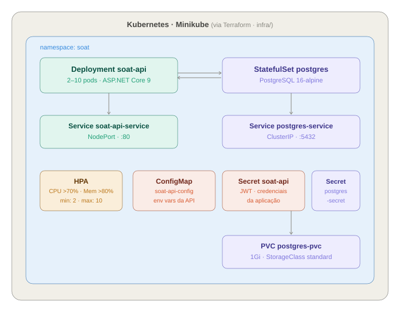
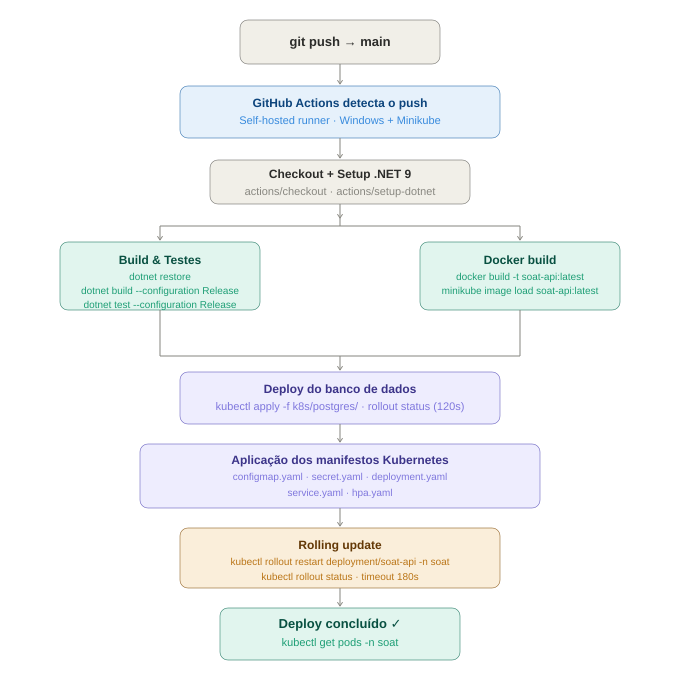

# Infraestrutura — SOAT Tech Challenge

> Esta página descreve a infraestrutura da **Fase 3** (nuvem real, AWS). O histórico da Fase 2 (Minikube local) fica registrado no fim da página para rastreabilidade.

## Visão geral (4 repositórios)

A partir da Fase 3, a infraestrutura é dividida em repositórios com responsabilidade única, cada um com seu próprio Terraform e CI/CD:

| Repositório | Provisiona |
|---|---|
| [infra-k8s](https://github.com/monnclaro/soat-tech-challenge-infra-k8s) | VPC, Amazon EKS, New Relic Kubernetes integration, dashboards e alertas |
| [infra-database](https://github.com/monnclaro/soat-tech-challenge-infra-database) | Amazon RDS PostgreSQL, credenciais em SSM SecureString |
| [lambda](https://github.com/monnclaro/soat-tech-challenge-lambda) | Lambda de autenticação por CPF, API Gateway |
| **soat-tech-challenge** (este repositório) | Manifests da aplicação (`k8s/`) — Deployment, Service (NodePort), HPA, ConfigMap |

Diagrama de componentes completo: [architecture.md](./architecture.md). Infraestrutura ajustada para AWS Academy (sem ALB, sem NAT, sem Secrets Manager) — ver [ADR 0008](./adr/0008-prioridade-de-custo-aws-academy.md).

## Kubernetes (aplicação)

Este repositório só aplica os manifests da aplicação contra o cluster já provisionado pelo infra-k8s, no namespace `soat`.

### Recursos aplicados por este repositório

| Recurso | Nome | Tipo | Descrição |
|---|---|---|---|
| Namespace | `soat` | Namespace | Isolamento dos recursos da aplicação |
| ConfigMap | `soat-api-config` | ConfigMap | Variáveis não sensíveis (ambiente, instrumentação New Relic) |
| Secret | `soat-api-secret` | Secret | Gerado pelo CI/CD a partir do SSM Parameter Store (RDS + JWT) — nunca versionado com valores reais |
| Deployment | `soat-api` | Deployment | API com rolling update, init container do New Relic, readiness/liveness via `/health` |
| Service | `soat-api-service` | NodePort (porta 30080) | Exposição pública direta — sem ALB (ver [ADR 0008](./adr/0008-prioridade-de-custo-aws-academy.md)); alvo do `HTTP_PROXY` do API Gateway (repo lambda), que chama o IP público do node |
| HPA | `soat-api-hpa` | HorizontalPodAutoscaler | Escalabilidade automática (CPU 70% / memória 80%) |

O banco de dados **não roda mais no cluster** — é o RDS provisionado pelo infra-database (ver [ADR "Postgres gerenciado em vez de StatefulSet"](./adr/0007-postgres-gerenciado.md)).

## Fluxo de Deploy (CI/CD)

O pipeline ([`.github/workflows/ci-cd.yml`](../.github/workflows/ci-cd.yml)) roda em runners hospedados do GitHub (não mais self-hosted) e é acionado a cada push em `main`:

| Etapa | Descrição |
|---|---|
| **Build & Test** | `dotnet build` + `dotnet test` (.NET 9) |
| **Login no ECR** | Com as credenciais de sessão do AWS Academy (ver [ci-cd-governance.md](./ci-cd-governance.md)) |
| **Build e push da imagem** | Tag = SHA do commit — cada deploy usa uma imagem imutável e rastreável |
| **Atualizar kubeconfig** | `aws eks update-kubeconfig` contra o cluster `soat-producao` |
| **Gerar Secret** | Busca RDS + JWT no SSM Parameter Store (`SecureString`) e recria `soat-api-secret` |
| **Aplicar manifests** | `kubectl apply` em `k8s/*.yaml`, com `envsubst` para a tag da imagem |
| **Aguardar rollout** | `kubectl rollout status deployment/soat-api` |
| **Publicar IP do node** | `aws ssm put-parameter /soat/producao/app/node-ip` — consumido pelo repo lambda (sem ALB, aponta pro IP público de um node) |

Detalhes de environments, proteção de branch e segredos: [ci-cd-governance.md](./ci-cd-governance.md).

---

## Histórico — Fase 2 (Minikube local)

Infraestrutura da Fase 2, superada pela Fase 3 (mantida para referência histórica)

A infraestrutura era orquestrada no Kubernetes (Minikube) dentro do namespace `soat`, com Postgres rodando como StatefulSet no próprio cluster e Terraform local (`infra/`, removido na Fase 3) provisionando os recursos via `kubernetes` provider contra o Minikube. O CI/CD rodava em um runner self-hosted Windows que garantia o Minikube de pé a cada execução.

