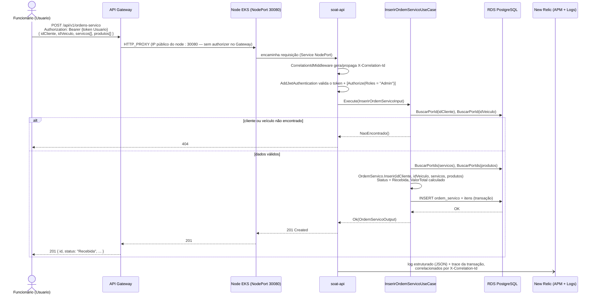

# Diagrama de Sequência — Abertura de Ordem de Serviço

Fluxo de um funcionário autenticado abrindo uma ordem de serviço para um cliente/veículo já cadastrados. `POST /api/v1/ordens-servico` exige role `Admin` — abertura de OS é uma operação de back-office, não self-service do cliente (ver [RFC 0003](./rfcs/0003-estrategia-de-autenticacao.md)).

## Transições de status subsequentes

Após a abertura (`Recebida`), a OS avança por `EmDiagnostico` → `AguardandoAprovacao` → `EmExecucao` → `Finalizada` → `Entregue`, cada uma via métodos específicos da entidade `OrdemServico` (`src/Domain/OrdensServico/OrdemServico.cs`). A consulta de status (`GET /api/v1/ordens-servico/{id}/status`) é a rota liberada também para clientes (`Cliente,Admin`) — ver [sequence-auth-cpf.md](./sequence-auth-cpf.md) para o fluxo de autenticação que precede essa chamada quando quem consulta é o cliente.
