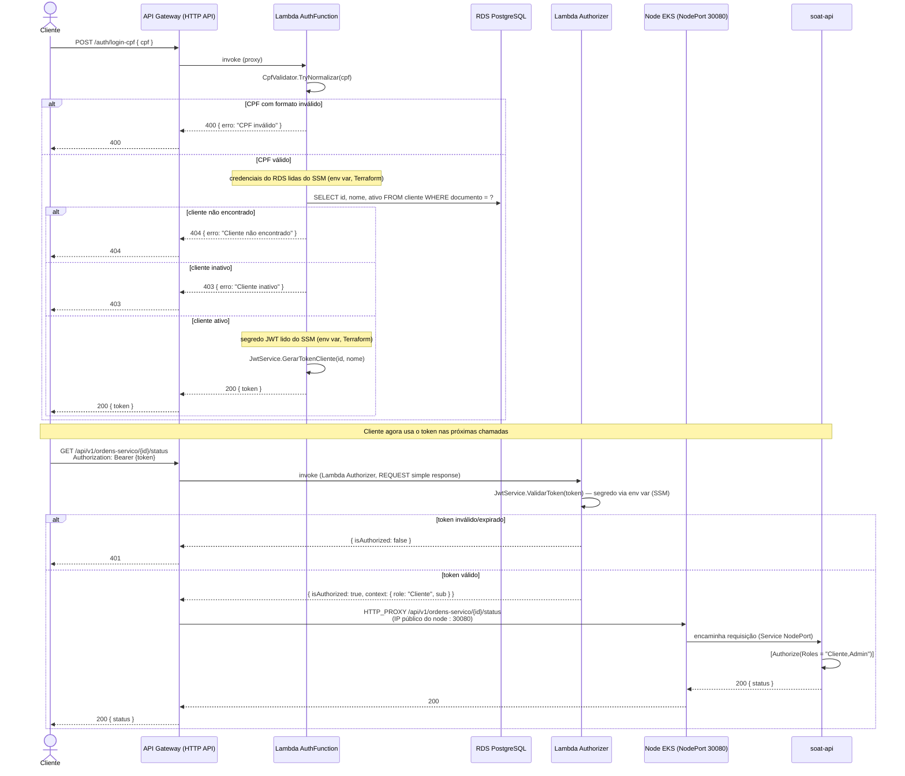

# Diagrama de Sequência — Autenticação por CPF

Fluxo completo: cliente informa o CPF, recebe um JWT, e usa esse token para acessar uma rota protegida (ex.: consultar status de uma ordem de serviço). Segredos lidos do SSM Parameter Store, exposição via NodePort — sem Secrets Manager nem ALB (ver [ADR 0008](./adr/0008-prioridade-de-custo-aws-academy.md)).

