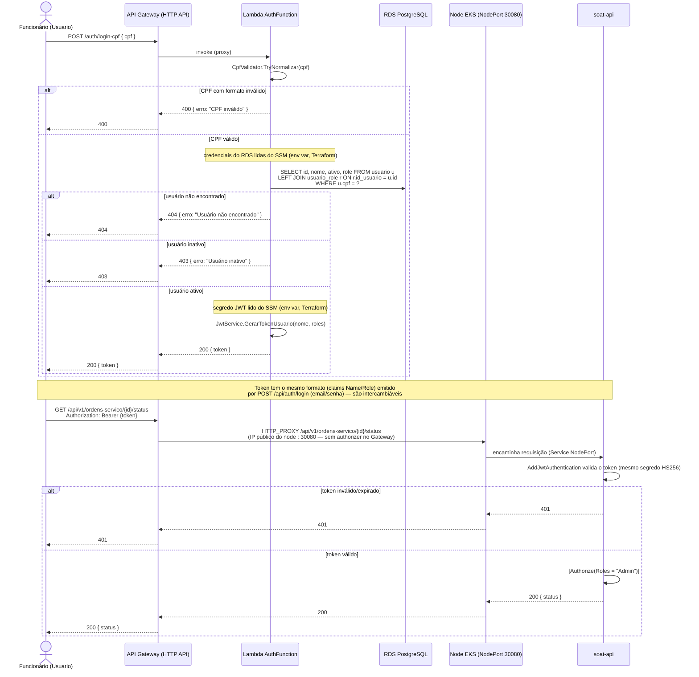

# Diagrama de Sequência — Autenticação por CPF

Fluxo completo: um funcionário (`Usuario`) informa o CPF como segunda forma de login (alternativa ao email/senha já existente), recebe um JWT, e usa esse token para acessar uma rota sensível do back-office (ex.: consultar status de uma ordem de serviço). Segredos lidos do SSM Parameter Store, exposição via NodePort — sem Secrets Manager nem ALB (ver [ADR 0008](./adr/0008-prioridade-de-custo-aws-academy.md)). Sem Lambda Authorizer: o JWT é validado pela própria API, não no Gateway (ver [ADR 0009](./adr/0009-sem-lambda-authorizer.md)).

