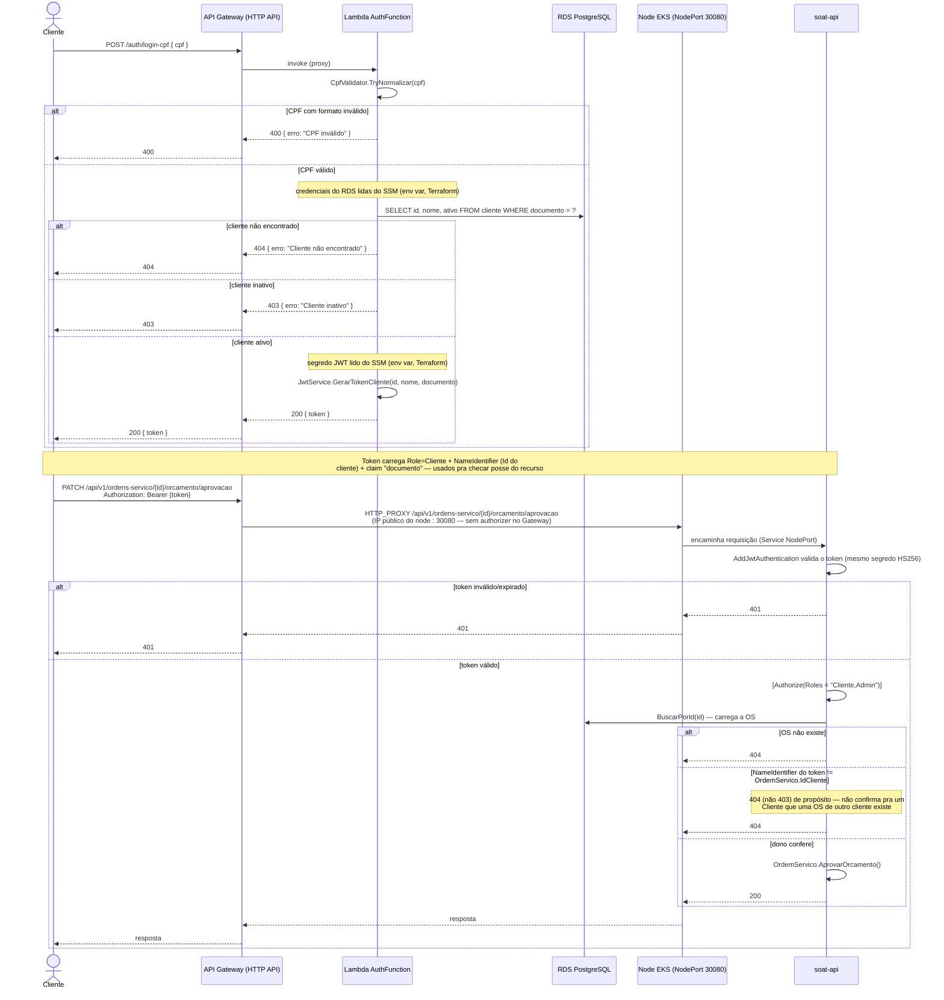

# Diagrama de Sequência — Autenticação por CPF

Fluxo completo: um cliente da oficina informa o CPF, recebe um JWT com role `Cliente`, e usa esse token pra acessar uma rota escopada pra ele (ex.: aprovar o próprio orçamento). Segredos lidos do SSM Parameter Store, exposição via NodePort — sem Secrets Manager nem ALB (ver [ADR 0008](./adr/0008-prioridade-de-custo-aws-academy.md)). Sem Lambda Authorizer: o JWT é validado pela própria API, não no Gateway (ver [ADR 0009](./adr/0009-sem-lambda-authorizer.md)).

```mermaid
sequenceDiagram
    actor Cliente
    participant GW as API Gateway (HTTP API)
    participant Auth as Lambda AuthFunction
    participant RDS as RDS PostgreSQL
    participant Node as Node EKS (NodePort 30080)
    participant API as soat-api

    Cliente->>GW: POST /auth/login-cpf { cpf }
    GW->>Auth: invoke (proxy)
    Auth->>Auth: CpfValidator.TryNormalizar(cpf)
    alt CPF com formato inválido
        Auth-->>GW: 400 { erro: "CPF inválido" }
        GW-->>Cliente: 400
    else CPF válido
        Note over Auth: credenciais do RDS lidas do SSM (env var, Terraform)
        Auth->>RDS: SELECT id, nome, ativo FROM cliente WHERE documento = ?
        alt cliente não encontrado
            Auth-->>GW: 404 { erro: "Cliente não encontrado" }
            GW-->>Cliente: 404
        else cliente inativo
            Auth-->>GW: 403 { erro: "Cliente inativo" }
            GW-->>Cliente: 403
        else cliente ativo
            Note over Auth: segredo JWT lido do SSM (env var, Terraform)
            Auth->>Auth: JwtService.GerarTokenCliente(id, nome, documento)
            Auth-->>GW: 200 { token }
            GW-->>Cliente: 200 { token }
        end
    end

    Note over Cliente,API: Token carrega Role=Cliente + NameIdentifier (Id do<br/>cliente) + claim "documento" — usados pra checar posse do recurso

    Cliente->>GW: PATCH /api/v1/ordens-servico/{id}/orcamento/aprovacao<br/>Authorization: Bearer {token}
    GW->>Node: HTTP_PROXY /api/v1/ordens-servico/{id}/orcamento/aprovacao<br/>(IP público do node : 30080 — sem authorizer no Gateway)
    Node->>API: encaminha requisição (Service NodePort)
    API->>API: AddJwtAuthentication valida o token (mesmo segredo HS256)
    alt token inválido/expirado
        API-->>Node: 401
        Node-->>GW: 401
        GW-->>Cliente: 401
    else token válido
        API->>API: [Authorize(Roles = "Cliente,Admin")]
        API->>RDS: BuscarPorId(id) — carrega a OS
        alt OS não existe
            API-->>Node: 404
        else NameIdentifier do token != OrdemServico.IdCliente
            Note over API: 404 (não 403) de propósito — não confirma pra um<br/>Cliente que uma OS de outro cliente existe
            API-->>Node: 404
        else dono confere
            API->>API: OrdemServico.AprovarOrcamento()
            API-->>Node: 200
        end
        Node-->>GW: resposta
        GW-->>Cliente: resposta
    end
```
